## Summary
基于详细用例的数据空间工作流程。
## To be translated

Oh Sorry!

This blog has't been translated to English, please wait for a little while...

## 等待被翻译

非常抱歉，看起来这篇博文还没有被翻译成中文，请等待一段时间

## 1 概要
参考资料：[DSBA Technical Convergence v2.0 chapter 6](https://data-spaces-business-alliance.eu/wp-content/uploads/dlm_uploads/Data-Spaces-Business-Alliance-Technical-Convergence-V2.pdf)

本节实现了一个场景，其中数据服务提供者在公共平台上提供服务，以便服务消费方能够获取该服务的访问权限。此外，这些消费方可以将获取的服务访问权限委托给其用户/客户。

本节用例：数据服务提供者是一个包裹递送公司，支持创建和管理包裹递送订单，并且提供查看和修改订单的特定属性的服务；消费方是向其客户提供商品系统的零售商，他们可以通过数据空间市场获得对包裹递送公司服务的访问权，并将访问权委托给客户。

在参考用例中，涉及到多个参与方，每个参与方都有自己的基础设施。具体包括：

1. 数据空间市场： 用于创建服务产品和获取访问权限的公共市场。
2. 信任锚： 担任方案管理员角色，持有有关每个参与方的信息【（包括通用唯一识别码，称为欧盟经济体注册和识别号（Economic Operators Registration and Identification: EORI number）】，并允许它检查每个参与方的准入情况。
3. 包裹递送公司：提供检索和更新包裹交付订单数据的服务。
4. Happy pets: 高级宠物零售商。此外，还涉及两个人类角色：Happy Pets 员工和Happy Pets 客户。
5. No Cheaper： 提供大幅折扣的零售商。此外，还涉及两个人类角色：No Cheaper 员工和 No Cheaper 客户。

总体架构如下：
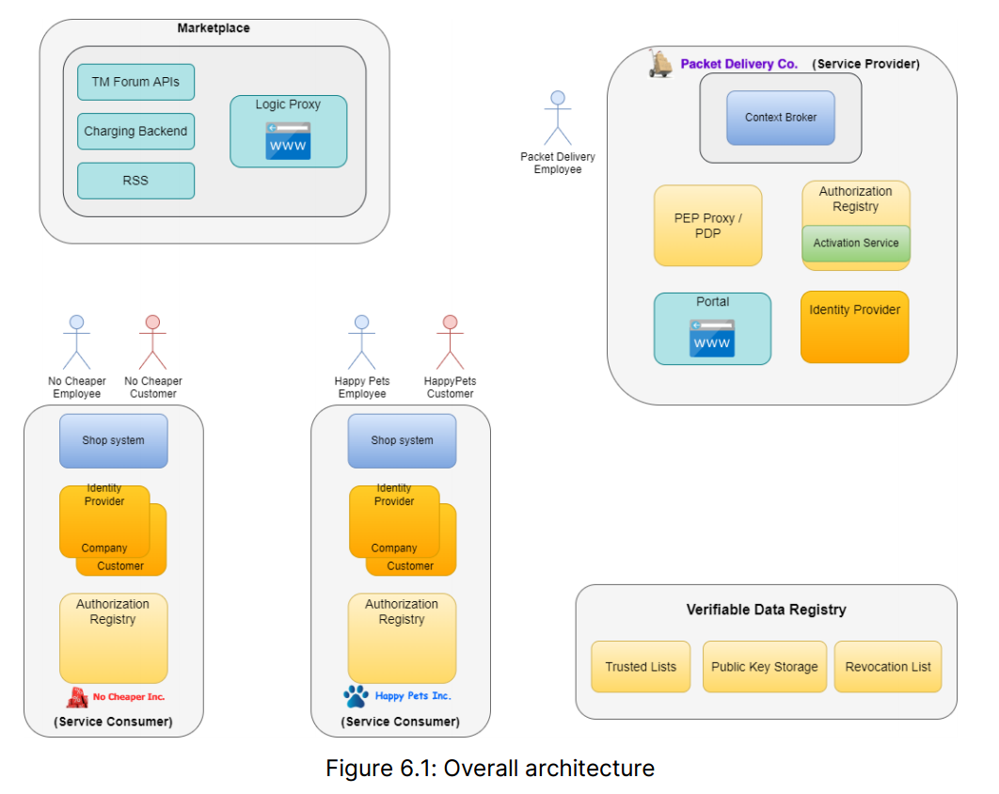

+ 包裹递送公司和商店系统的服务提供者各自拥有自己的身份提供者（identity provider: IdP）和授权注册表（authorization registry）。
+ 包裹递送公司托管了一个门户（portal），允许用户查看和修改包裹递送订单的属性。
+ 订单实体（entity）存储在上下文代理（context broker）的实例（instance）中。
+ 对包裹递送订单实体的读写访问（read-and-write access）由策略执行点（policy enforcement point: PEP proxy）代理和策略决定点（policy decision point: PDP）控制，这会在之后的各个参与方详细介绍到。

<a id="components"></a>
## 2 各部分详解 
### 2.1 包裹递送公司

对应的架构图如下：
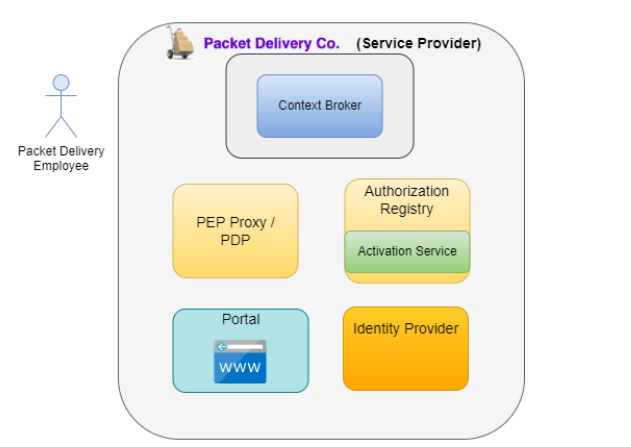
Packet Delivery是一家提供全球包裹递送服务的物流公司。它提供两种包裹递送服务：
- 标准包裹递送服务
    - 客户可以指定包裹的发件人、收件地址、包裹准备取件的日期和时间，以及包裹的收件人姓名和地址。
    - 当包裹递送公司收到客户的包裹递送订单时，它会返回包裹计划送达的目标日期。
    - 在定义的条款和条件下（terms and conditions）【例如：无海关违规，地址有效等】，它承诺在同一国家内48小时内交付包裹，国际运输则需5-6天。
    - 然而，客户不能调整具体的送达日期（例如，将其延迟到更适合的日期）或在选定的送达日期内微调具体的送达时间。
- 金牌包裹递送服务
    - 客户享受标准包裹递送的所有好处，同时还可以在提供的时间段内调整具体的送达地址、送达日期，以及在选定的送达日期内微调具体的送达时间，前提是这些调整是可行的（例如，提前足够时间提出请求，并且不会产生额外费用）。


包裹递送公司以电子方式向不同的零售商提供服务，让他们通过REST API访问其包裹交付信息系统(P.Info)来发布包裹递送订单、追踪订单位置、允许被他们授权的顾客执行调整地址、日期和计划交付时间的请求。

##### 2.1.1 DELIVERYORDER
P.Info通过上下文代理（context broker）提供的NGSI-LD接口实现的。DELIVERYORDER是一个具有以下属性的实体：
- issuer
- pickingAddress（取件地址）
- pickingDate（取件日期）
- pickingTime（取件时间）
- destinee（收件人）
- deliveryAddress（送达地址）
- PDA（planned date of arrival，计划送达日期）
- PTA（planned time of arrival，计划送达时间）
- EDA（expected date of arrival，预期送达日期）
- ETA（expected time of arrival，预期送达时间）
  
Packet Delivery为其P.Info系统定义了两个角色：P.Info.standard和P.Info.gold，并根据这些角色定义了通过上下文代理服务可以对上述属性执行的操作。

为了简化场景描述，我们将关注送达地址、计划送达日期和计划送达时间这三个属性，因为我们可以假设其他属性在订单创建时将被分配值，始终可读，但用户无法通过已定义的角色进行更改。对于这三个属性，一旦订单创建后，以下策略适用于已定义的角色：
| Path      | Verb | Verb    |
|/ngsild/v1/entities/{entityID}/attrs/{attrName} | GET|PATCH|
| :-------        |    :----:   |          ---: |
|   deliveryAddress   | P.Info.standard/gold      | P.Info.gold   |
| EDA   | P.Info.standard/gold       | ---     |
| ETA   | P.Info.standard/gold       | ---     |
| PDA   | P.Info.standard/gold       | P.Info.gold     |
| PTA   | P.Info.standard/gold       | P.Info.gold     |

注意，订单将使用不同的路径（/ngsi-ld/v1/entities/）通过POST创建。为了发出此类请求，定义了一个额外的角色P.Create，该角色仅分配给Happy Pets和No Cheaper。

包裹递送公司针对潜在零售商和其他类型公司发布两种产品：
- 基础（basic）递送：允许获取该服务的公司向其客户提供标准包裹递送服务。
- 高级（premium）递送：允许获取该服务的公司向其客户提供标准和金牌包裹递送服务。

需要注意的是，Packet Delivery**不应了解任何零售商应用程序（application）用户的身份**。它只需要能够在接收到请求时：

a）**识别**该请求来自于与获取其平台产品（offering）的零售商公司相关联的用户

b）**确定**用户在零售商公司为其分配的P.Info应用程序中的角色（role，即P.Info.standard或P.Info.gold）

c）**检查**该角色是否是该零售商公司可以分配的角色，考虑到它在平台上获得的产品（offering）

在完成这些步骤后，Packet Delivery将只需检查拥有该角色的用户是否可以执行所请求的操作。

由No Cheaper创建的应用程序，无论其是否为用户分配了P.Info.gold角色，都无法成功更改某个订单的PTA属性的值，因为它已获取的标准包裹递送服务不允许更改这些值。（因为No Cheaper是廉价型公司，所以没有分配P.Info.gold角色的权限）。　

### 2.2 数据服务消费者：HappyPets Inc.
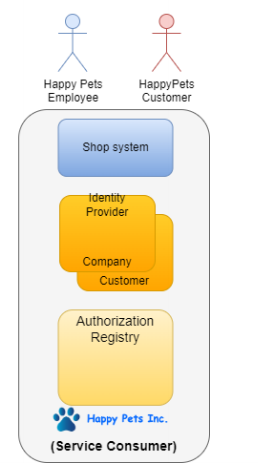
HappyPets Inc.（简称HappyPets）是一家销售宠物用品的公司。它将在市场上获得“高级递送”服务。这将使其能够通过HappyPets的商店应用程序向客户提供标准和金牌配送服务。此外，公司内部可能有某些员工，即公司提供的电话帮助台服务的主管和代理，他们可能会使用内部应用程序（HappyPetsBackOffice）更改给定订单的送货地址、PDA和PTA。

当客户在HappyPetsStore注册时，它可以作为“普通”客户或“主要”客户（支付年费）。“普通”客户将获得标准包裹递送服务，而“优质”客户将获得金牌包裹递送服务。这意味着他们分别在HappyPetsStore应用程序中被分配了P.Info.standard角色和P.Info.gold角色。

另一方面，不同的员工在HappyPetsBackOffice应用程序中被分配了不同的角色，因此在实体店（physical shop）担任监督员（supervisor）角色的员工或在中央帮助台工作的代理也被分配了P.Info.gold角色。

Happy Pets员工：
- 在平台上获取高级包裹递送产品。
Happy Pets客户：
- 在Happy Pets商店系统中注册并被分配为优质客户角色
    - 为简化，假设已经有一个Happy Pets客户已经注册为优质客户
- 在商店系统下单，其本质是在P.Info系统中创建了一个包裹递送订单
    - 为简化，假设已经为该客户在P.Info系统中创建了一个订单
- 成功通过Packet Delivery门户（portal）更改订单的PTA
    - 我们将在4. Detailed Workflow描述执行此操作的详细流程。

### 2.3 数据服务消费者：No Cheaper Ltd.
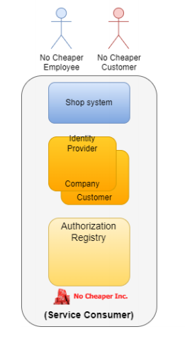
No Cheaper是一家以较大折扣销售各种产品的公司。它将在平台上获取Packet Delivery公司的基础包裹递送产品。

No Cheaper 员工：
- 在平台上获取基础包裹递送产品
No Cheaper 客户：
- 在No Cheaper商店系统中注册并被分配为普通客户角色
    - 为简化，假设已经有一个No Cheaper客户已经注册为普通客户
- 在商店系统下单，其本质是在P.Info系统中创建了一个包裹递送订单
    - 为简化，假设已经为该客户在P.Info系统中创建了一个订单
- 当尝试通过Packet Delivery门户（portal）更改订单的PTA时，被拒绝
- 还可以展示，当No Cheaper员工在其自己的身份提供者系统中为No Cheaper客户分配优质客户角色时，该请求也将被拒绝

### 2.4 数据市场平台
市场是基于[FIWARE BAE(Business Application Ecosystem) component](https://business-api-ecosystem.readthedocs.io/en/latest/)
组件构建的，该组件由FIWARE 业务框架和[TMForum](https://www.tmforum.org/)提供的一组API组成。它允许在整个服务生命周期（life cycle）内对不同类型的资产进行货币化（monetization），从创建产品（offering creation）到收费（charging）、记账（accounting）和涉及参与方的收入结算（revenue settlement required for billing and payment）。
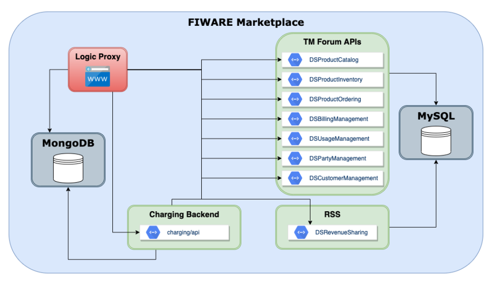
创建offer时的包裹递送订单参数，以及市场在获取和激活阶段执行的必要步骤的实现，都由安装在Charging Backend组件中的专用插件提供。

您可以在这里找到[Marketplace UI](https://github.com/i4Trust/bae-i4trust-theme)的专用主题。
### 2.5 信任锚框架

该系统使用可验证凭证(VC)，参与者通过did进行识别。为了对参与者的凭据和身份进行有效和分散的验证，必须实施基于区块链的信任框架，以避免在所有身份验证流中进行中央实体中介。

信任框架由两部分组成：
- 信任组织列表：存储在区块链中的受信任组织的身份列表，以及每个实体的相关信息。
- 管理流程：添加、修改和删除可信实体的流程，实现具体的治理模型。

信任框架的设计很大程度上是去中心化的，代表了现实世界中的信任关系。这里我们描述一种可能的实现方法一个基于区块链的信任框架。

特点：
- 去中心化的信任系统：生态系统中中涉及的法人的身份注册在区块链中的公共目录，遵循与互联网中的DNS模式非常相似的分层方案。
- 自主管理子实体：一旦在系统中注册了一个实体，他就可以完全自主的添加作为子实体管理的其他实体。
- 明确、透明、可审计：任何参与者都可以获得关于生态系统当前信任结构的可信信息，以及导致系统处于当前状态的事件。例如，哪个实体注册了另一个实体，什么时候完成，父实体给子实体分配了什么属性。
- 根信任实体：这个系统可以非常去中心化。然而，有一个集中的元素：位于层次结构顶部的信任根应该是生态系统中负责引导系统的受信任实体（或实体联盟）。根据生态系统的具体治理框架，这可能是根实体的唯一使命，可能包括对生态系统的监测和监督。一般来说，它应该是一个监管机构、公共行政部门或一个中立的组织，被生态系统中所有参与者完全信任。
- 层级结构：信任框架支持多层级结构，以适应不同的治理需求。

单个区块链网络的方法如下图所示（该方案很容易扩展到不同的区块链网络，我们希望在它们之间建立信任，以便一个网络中的实体可以以可信的方式与另一个网络中的实体进行交互）。
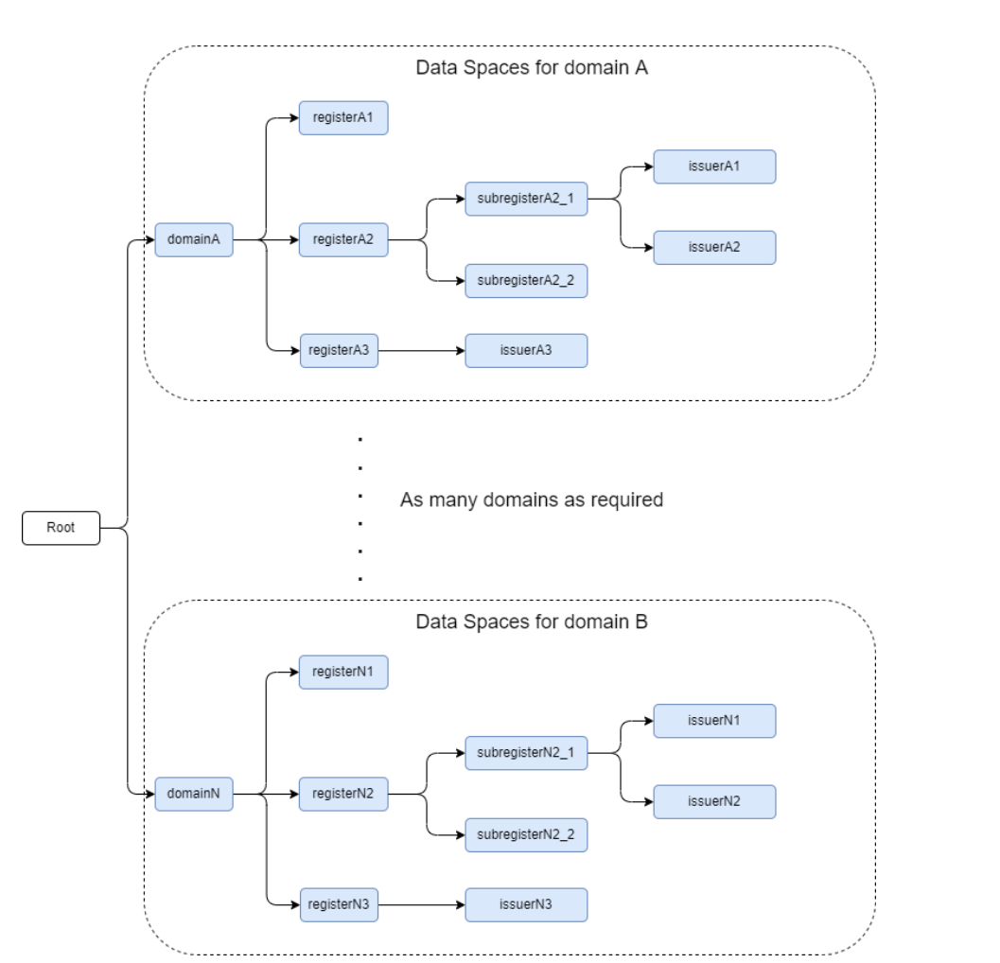
- 根部：这个实体在EBSI中称为可信注册机构（TRA），在其他上下文中称为“可信锚”。我们将在下面的描述中使用术语可信锚。其本质特征是，这是生态系统中最受信任的实体/实体。**根实体负责注册其他一些受信任实体的身份**。
    - 例如，在一个国家的多个地区拥有管理大学的自主权，教育部可以在区块链上注册负责管理各地区大学的区域机构的身份。如图中的domainA, domainN。 
    - 一旦这个注册完成，每个区域机构可以继续注册它们的下属实体的身份，例如大学。如图中的registerA1等。
    - 多层次管理。例如，一所大学可能很大，有几个具有一定自主权的组织单位，可能分布在地理上。它可以创建子身份并将其注册为区块链中的子节点。如图中subregisterA2_1。

#### 2.5.1 注册生态系统身份
新身份注册：
- 一个新的身份只能由已经存在的身份来注册。
- 唯一例外，信任锚。它是将智能合约部署到区块链的实体，因此它具有特殊权限。在部署时，智能合约允许注册信任锚点的身份和相关信息。
域名分配：
- 系统中的每个合法身份都会被分配一个域名，类似于互联网中的域名系统。当创建一个新身份时，它会被分配一个名称，并根据父身份自动设置为子域名。
- 例外：根域名（即信任锚）没有名字，是系统中最高级的身份。
    - 例如， 图中实体issuerA1 有完整域名：domainA.registerA2.subregisterA2_1.issuerA1。这个完整的域名能够唯一地标识该实体，确保在系统中没有重复或混淆。在这个例子中，“domainA”是一个最高级域名，它应该已经由信任锚实体添加到系统中。
- 注册限制：一个实体只能由其父实体进行注册，信任框架中的其他任何实体，包括其父实体的父实体，都无法进行注册。组织需要对其所有子实体负责，这些子实体在信任框架中被表示为子节点。
  
外部第三方在具有读取区块链权限的情况下，可以看到整个信任结构，包括从系统启动以来的不可篡改的历史事件。这种透明性对于确保系统的可信度和安全性至关重要。

#### 2.5.2 验证身份：通用解析器
通用解析器的功能：
- 通用解析器是一个公开的API，可以被任何参与者用来验证身份。它解析去中心化身份标识符（DID），并支持多种DID方法。
- 通过解析DID，确保参与者能够验证身份的真实性。
DID解析过程：
- DID解析是获取DID文档的关键步骤，涉及“读取”、“创建”、“更新”和“注销”四个主要操作。
- 解析后，还可以进行DID URL解引用，即获取DID URL代表的资源。
在SIOP（Self-Issued OpenID Provider）流程中的应用：
- 在SIOP流程中，进行DID解析用于获取实体的公钥，并验证其签名，以确保信息交换的安全性。DID文档中的公钥是通过DID解析获得的。
PS：为避免中心化风险，建议在多个节点上运行通用解析器，或者依赖可信的第三方。

## 3 生态系统中的可验证凭据
在本节中，我们将描述生态系统中功能所需的不同类型的凭证。
### 3.1 Packet Delivery 员工
Packet Delivery向它的一些员工发放凭据，这样他们就可以访问Marketplace，创建产品或购买产品。
该凭证由Packet Delivery的员工用于向第三方证明其有权代表雇佣公司（本例中为Packet Delivery）使用某些第三方提供的服务。**换句话说，凭证用作Packet Delivery将其访问控制权利委托（delegate）给一个或多个员工的机制**。
证书的基本特征：
- 自发行以来，无人篡改过证书的内容。因为证书是由颁发者Packet Delivery进行数字签名的。
- 证明发行者是Packet Delivery，因为验证凭证签名的公钥与在信任框架中注册的Packet Delivery的真实身份以加密方式相关联。
- （可选）它可以证明凭证的发布不迟于给定时间，因为凭证在发布时已在区块链中注册（时间戳）。
    - Note1: 时间戳的日期可以大于证书内包含的“签发日期”字段中的日期。例如，一次创建并签名凭据，但在第二天打上时间戳（可能是为了与其他凭据一起批处理操作）。关键是，没有人可以创建过去的凭证。验证器必须检查凭据“签发时间”内的字段不晚于时间戳（至少要留有一点余地，以考虑时钟同步差异）。
    - Note2：许多凭证可能不需要时间戳，从而避免了注册过程的开销。这完全取决于凭证的类型、凭证的预期用途和假定的风险级别。这里讨论的员工凭证是不需要具有相同风险级别的时间戳的凭证的一个示例。验证者要求的唯一一件事是，持有者可以证明在使用凭证的时候（例如：（登录）），凭证是由雇主颁发的（在我们的例子中是Packet Delivery）。显然，这并不需要时间戳，因为如果员工可以在执行登录时提供凭据，那么只有在凭据以前颁发过的情况下，她才能这样做。

从以上描述中，我们可以为接收凭证的验证者得出以下信任属性：
- 对凭证发行者身份的信任程度取决于验证者对信任框架中实施的注册过程的信任程度。注册过程将发行者的公钥与其真实身份关联起来。
- 对凭证内声明的信任程度取决于验证者对发行者实体的信任程度。例如，Packet Delivery可以向并非真正员工的人士签发员工凭证。然而，如果发生这种情况，验证者有一个强有力的不可否认的机制来向第三方（例如法院）证明发行者陈述了错误的事实。
由此可见，Packet Delivery可以签发包含某些员工数据（姓名、姓氏等）的员工凭证，并且验证者可以对这些声明给予一定程度的信任。

但这只是证明了Packet Delivery证明凭证（称为声明）中的数据是真实的。它没有说明在线提交凭证的人是否与索赔中提到的人相同。换句话说，**将员工凭证发送给验证者的人可能与员工不同**。这就是凭证包含公钥作为与员工关联的声明之一的原因（在“credentialSubject”对象中）。

该公钥对应于在员工设备（PC或移动设备）上凭证签发过程中生成的私钥。该过程稍后将详细说明，但基本上包含以下流程：
- 员工生成一对公钥/私钥，并通过经过身份验证和加密的通道（例如，HTTPS）将公钥发送给雇主。该通道可以是员工用于连接企业应用程序的常用机制。
- 雇主生成包含某些员工数据的凭证并包括公钥。
- 雇主签署凭证并通过同一经过身份验证的通道将其发送给员工。

下面这个例子是由发行者Packet Delivery颁发凭证的元数据和可视化后的具体内容：
 ```JSON
// Credential issued by PacketDelivery to its employees, providing access to 
// Marketplace, either to create offerings or to purchase offerings. 
{ 
    "@context":[ 
    "https://www.w3.org/2018/credentials/v1", 
    "https://marketplace.fiware.io/2022/credentials/employee/v1" 
    ], 
    "id": "https://pdc.fiware.io/credentials/6e14b8b8-87fa0014fe2a", 
    "type": ["VerifiableCredential", "EmployeeCredential"], 
    "issuer": { 
         "id": "did:elsi:EU.EORI.NLPACKETDEL" 
    }, 
    "issuanceDate": "2022-03-22T14:00:00Z", 
    "validFrom": "2022-03-22T14:00:00Z", 
    "expirationDate": "2023-03-22T14:00:00Z", 
    "credentialSubject": { 
        "id": "did:peer:99ab5bca41bb45b78d242a46f0157b7d", 
        "verificationMethod":[ 
        { 
             "id":"did:peer:99ab5bca41bb45b78d242a46f0157b7d#key1", 
             "type":"JwsVerificationKey2020", 
             "controller": "did:peer:99ab5bca41bb45b78d242a46f0157b7d", 
             "publicKeyJwk": { 
                  "kid":"key1", 
                  "kty":"EC", 
                  "crv":"P-256", 
                  "x":"lJtvoA5_XptBvcfcrvtGCvXd9bLymmfBSSdNJf5mogo", 
                  "y":"fSc4gZX2R3QKKfHvS3m2vGSVSN8Xc04qsquyfEM55Z0" 
             } 
         } 
    ], 
        "roles": [ 
        { 
             "target": "did:elsi:EU.EORI.NLMARKETPLA", 
             "names": ["seller", "buyer"] 
        } 
        ], 
        "name":"Jane Doe", 
        "given_name":"Jane", 
        "family_name":"Doe", 
        "preferred_username":"j.doe", 
        "email": "janedoe@packetdelivery.com" 
    } 
} 
```
上述凭证的结构可以可视化如下：
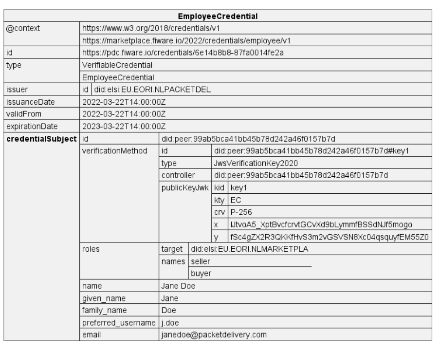
该凭证类型为EmployeeCredential，并且为了启用对市场的访问，其中嵌入的角色可以是buyer、seller或两者兼有。@context字段中的URL指向市场（https://pdc.fiware.io/2022/credentials/employee/v1） ，该市场定义了员工凭证的一般要求。然而，生态系统中的参与者可以扩展它，并当然可以使用他们自己目的所需的角色和角色名称。 

凭证中的credentialSubject部分具有以下对象：
- id，指定为DID。出于隐私原因，并且鉴于这是自然人，因此使用了W3C Peer DID方法规范中指定的Peer Method。该方法可以独立于任何中央真理源（central source of truth）使用，并且旨在便宜、快速、可扩展且安全。它适用于大多数人、组织和事物之间的私人关系。
- verificationMethod，这是一个标准的W3C VC对象，指定了与员工的DID关联的公钥。员工的DID与公钥之间的绑定在Packet Delivery签发凭证时完成。
- roles是一个包含一个或多个角色规范的数组。每个规范定义一个将接收凭证的潜在目标实体，以及该目标实体定义的一个或多个角色名称。
  - target是将接收凭证的实体的DID。
  - names是一个包含一个或多个角色的数组，这些角色是目标实体认可的，并将由目标实体用于应用其自己的访问控制策略。在示例中，我们使用了市场定义的buyer和seller角色。其他实体可以为其特定目的定义自己的角色。名称在生态系统中由于目标属性而变得唯一。
- 凭据中的其余字段在标准W3C可验证凭据数据模型中具有通常的含义。

顶层的“id”字段是凭证的标识，如果需要该功能，可将其用于撤销。“ id ”字段的基本要求是:
- 它在将要使用的范围内是唯一的
- 它基于加密安全的随机数生成器，因此很难被可能试图撤销给定凭据的潜在攻击者“猜测”。使用这样的id可以将攻击者猜测id的概率降低到与攻击者猜测私钥相同的水平，
- 它与证书中包含的个人资料没有任何关系，以尽量减少相关性的风险。
- UUID版本4符合所有这些要求，但也可以使用其他模式。

### 3.2 Happy Pets or No Cheaper 员工凭证
Happy Pets和No cheap公司发给员工的员工证书实际上与上文所述的Packet Delivery公司的员工证书相同。主要区别在于分配给员工的角色集和在“角色”声明中指定的角色集。
```javascript
// Credential issued by HappyPets to its employees, providing access 
// to order creation in PacketDelivery. 
{ 
    "@context":[ 
        "https://www.w3.org/2018/credentials/v1", 
        "https://happypets.fiware.io/2022/credentials/employee/v1" 
    ], 
    "id":"https://happypets.fiware.io/credentials/25159389-8dd17b796ac0", 
    "type": ["VerifiableCredential", "EmployeeCredential"], 
    "issuer": { 
        "id":"did:elsi:EU.EORI.NLHAPPYPETS" 
    }, 
    "issuanceDate": "2022-03-22T14:00:00Z", 
    "validFrom": "2022-03-22T14:00:00Z", 
    "expirationDate": "2023-03-22T14:00:00Z", 
    "credentialSubject": { 
        "id": "did:peer:99ab5bca41bb45b78d242a46f0157b7d", 
        "verificationMethod":[ 
        { 
             "id":"did:peer:99ab5bca41bb45b78d242a46f0157b7d#key1", 
             "type":"JwsVerificationKey2020", 
             "controller":"did:peer:99ab5bca41bb45b78d242a46f0157b7d", 
             "publicKeyJwk": { 
                 "kid":"key1", 
                 "kty":"EC", 
                 "crv":"P-256", 
                 "x":"lJtvoA5_XptBvcfcrvtGCvXd9bLymmfBSSdNJf5mogo", 
                 "y":"fSc4gZX2R3QKKfHvS3m2vGSVSN8Xc04qsquyfEM55Z0" 
             } 
        } 
        ], 
        "roles":[ 
        { 
             "target": "did:elsi:EU.EORI.NLPACKETDEL", 
             "names": ["P.Create"] 
        } 
        ], 
        "name":"Jane Doe", 
        "given_name": "Jane", 
        "family_name": "Doe", 
        "preferred_username": "j.doe", 
        "email": "janedoe@packetdelivery.com" 
    } 
} 
```
### 3.3 Happy Pets or No Cheaper 顾客凭证
Happy Pets使用此凭据将访问控制**委托**给希望访问由Packet Delivery提供的服务的客户，这些服务是Happy Pets过去购买的。

它遵循与员工凭据相同的模型：
- 凭证应由Happy Pets通过作为先前客户注册过程（KYC）一部分的安全和认证渠道向客户发行。
- 凭证中包含的角色对应于客户类型，角色名称由服务提供者（在本例中为Packet Delivery）定义和理解。

```JSON
// Credential issued by HappyPets to a customer,
// providing access to Gold services at PacketDelivery.
{ 
    "@context":[ 
        "https://www.w3.org/2018/credentials/v1", 
        "https://happypets.fiware.io/2022/credentials/employee/v1" 
    ], 
    "id":"https://happypets.fiware.io/credentials/25159389-8dd17b796ac0", 
    "type": ["VerifiableCredential", "CustomerCredential"], 
    "issuer": { 
        "id":"did:elsi:EU.EORI.NLHAPPYPETS" 
    },
    "issuanceDate":"2022-03-22T14:00:00Z", 
    "validFrom":"2022-03-22T14:00:00Z", 
    "expirationDate":"2023-03-22T14:00:00Z", 
    "credentialSubject": { 
        "id":"did:peer:99ab5bca41bb45b78d242a46f0157b7d", 
        "verificationMethod":[ 
        { 
            "id":"did:peer:99ab5bca41bb45b78d242a46f0157b7d#key1", 
            "type":"JwsVerificationKey2020", 
            "controller":"did:peer:99ab5bca41bb45b78d242a46f0157b7d", 
            "publicKeyJwk":{ 
                "kid":"key1", 
                "kty":"EC", 
                "crv":"P-256", 
                "x":"lJtvoA5_XptBvcfcrvtGCvXd9bLymmfBSSdNJf5mogo", 
                "y": "fSc4gZX2R3QKKfHvS3m2vGSVSN8Xc04qsquyfEM55Z0" 
            } 
        } 
        ], 
        "roles":[ 
        { 
            "target":"did:elsi:EU.EORI.NLPACKETDEL", 
            "names": ["P.Info.gold"] // Or P.Info.standard 
        } 
        ], 
        "name": "Jane Doe", 
        "given_name": "Jane", 
        "family_name": "Doe", 
        "preferred_username": "j.doe", 
        "email": "janedoe@packetdelivery.com" 
    } 
} 
```
### 3.4 基于角色的访问控制
从上面的凭据中可以看到，它们包含指定角色的声明。角色不是由凭据的颁发者定义的，而是由将要接收凭据并执行身份验证和授权的提供者（即：依赖方）定义的，在本例子中，是Packet Delivery。

提供者定义了一个具有特定名称的角色，该角色映射到表示提供者希望执行（enforce）的某个策略集合（policy set）。平台上的一个产品就代表了某个角色（或多个角色）。在获得对平台上产品的访问权限时，这些角色会在提供者的**授权注册表**中签发给获得访问权限的组织。此外，获得访问权限的组织可以通过将这些角色嵌入到向其用户签发的**VC**中，将这些角色分配给他们的用户。

在访问服务时，由提供者的PEP代理（proxy）/PDP组件获取属于分配角色的基于属性的策略集合，并根据NGSI-LD请求进行访问授权评估。

本文件的范围不包括描述执行这些策略的实际策略语言和引擎（如ODRL、Rego等）。

### 3.5 组件部署
除了[第二节](#components)的各部分外，以下组件也是必须的：
- 可验证数据注册表(Verifiable Data Registry): 以区块链网络的形式，作为实现生态系统信任框架的核心技术。参与生态系统的一些实体（不一定是所有实体）应当操作区块链节点，以便协作创建和运营一个适合的区块链网络，作为信任框架的骨干。
- 通用解析器(Universal Resolver)：通用解析器根据[W3C DID Core 1.0](https://www.w3.org/TR/did-core/)和DID解析规范（资料提供的原链接已无法访问），解析多种不同DID方法的去中心化标识符（DID）。
- 凭证发行和验证组件（Credential Issuer and Verifier components）：这些组件通常作为现有实现OpenID Credential（OIDC）流程的组件的扩展来实现。
- 终端用户钱包（End-User wallet）：终端用户使用的钱包组件，用于**接收**、**持有**和**展示**已向其颁发的可验证凭证。该组件可以实现为原生移动应用程序、PWA应用程序，甚至是由生态系统中一个或多个高度可信赖的实体托管的Web应用程序。

## 4 详细工作流程

当使用带有可验证凭据的SIOP流时，可以观察到Marketplace不需要查询生态系统中的任何其他实体来验证凭据，因为所需的所有信息都在员工提供的可验证凭据和分散可验证注册表中（在我们的案例中使用区块链网络实现），通过通用解析器访问。

也就是说，工作流程实际上是点对点的，不需要查询集中式的IdP，从而提供了一个高效、可扩展、私有和弹性的框架。

### 4.1 订单创建
在架构概述中展示了不同的交互：
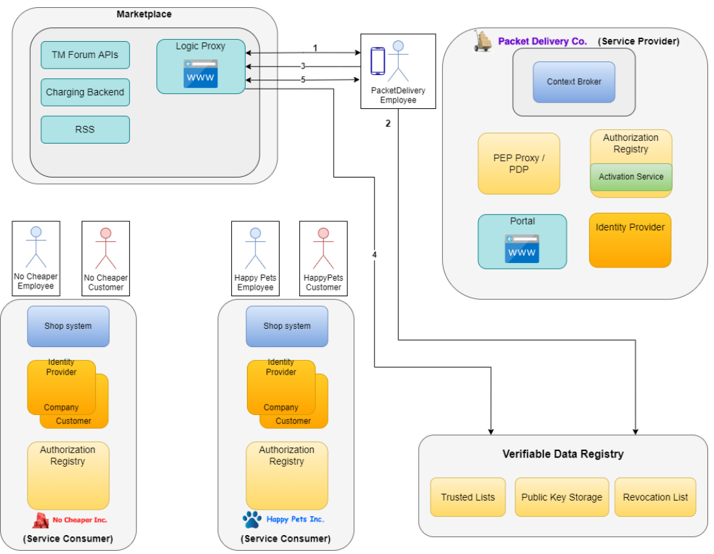
#### 4.1.1 用户访问
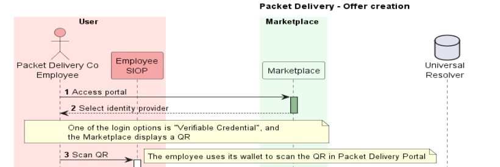
1.Packet Delivery员工访问Marketplace门户（由BAE Logic Proxy提供），以便登录。

2.Marketplace门户显示一个身份提供者列表，用于选择所需的身份提供者进行登录。其中一个登录选项是“使用可验证凭据登录”。Packet Delivery Co员工选择“可验证凭据”登录方法，这会导致Marketplace门户生成一个QR，其中包含Marketplace服务器的/身份验证请求端点的URL。

3.员工启用数字钱包中的扫描功能扫描QR，手机调用/身份验证请求端点。扫描的目的启动身份验证流程，确保登录用户确实是拥有该凭证的员工。
#### 4.1.2 启动身份验证流程

4.钱包会自动访问QR包含的URL来启动身份验证流程。此步骤中，钱包发送一个POST请求到指定的身份验证接口，向服务器请求验证信息。

5.SIOP（Self-Issued OpenID Provider）是一种开放的身份验证协议。这将启动一个标准的SIOP的流程。
其中市场扮演依赖方（OpenID Connect术语中的RP）的角色，员工的移动设备充当Self-Issued IDP。在此步骤中，Marketplace创建SIOP身份验证请求。由于自我发布的OP可能作为本机应用程序或渐进式web应用程序（PWA）运行，RP可能没有网络可寻址端点来直接与OP通信。我们必须利用OpenID Connect的隐式流来与这些本地运行的OP通信，如[https://openid.net/specs/openid-connect-self-issued-v2-1_0.html]所述。

6.身份验证请求作为SIOP返回给员工钱包。SIOP流使用一个新的响应模式post，该post用于请求SIOP将身份验证过程的结果传递到某个端点。参数response_mode用于携带该值。SIOP交付身份验证结果的端点在标准参数redirect_uri中定义。
#### 4.1.3 解析DID
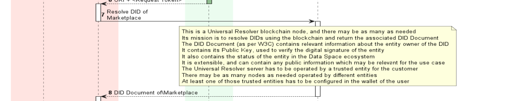
7.在此步骤中，员工通过解析在身份验证请求的**client_id**参数中接收到的Marketplace的DID来验证Marketplace是属于生态系统的受信任实体。

为了解析DID，钱包发送一个GET请求到/api/did/v1/identifiers/did:elsi:EU.EORI.NLMARKETPLA可以实现通用解析器功能的几个可信服务器端点之一。
- 通用解析器包括一个区块链节点，根据需要可以有多个节点。它的任务是使用区块链解析DID并返回相关的DID文档。
- DID文档（根据W3C）包含关于DID实体所有者的相关信息。它包含其公钥，用于验证实体的数字签名。它还包含实体在数据空间生态系统中的状态。它是可扩展的，并且可以包含与用例相关的任何公共信息。通用解析器服务器必须由客户的可信实体操作。可以有由不同实体操作的任意数量的节点。必须在员工的钱包中配置这些可信实体中的至少一个。

8.钱包可以获得Marketplace的DID文档。文档会提供市场的详细信息，包括市场的数字签名公钥，确保钱包与合法的市场实体进行交互。其中包含有关实体的可信信息，包含有关实体的可信信息，以及Marketplace用于对tokens进行数字签名的私钥关联的公钥。例如：
```JSON
{
    "payload": {
         "@context": [
            "https://www.w3.org/ns/did/v1",
            "https://w3id.org/security/v1"
        ],
        "id": "did:elsi:EU.EORI.NLMARKETPLA",
        "verificationMethod": [
        {
            "id": "did:elsi:EU.EORI.NLMARKETPLA#key-verification",
            "type": "JwsVerificationKey2020",
            "controller": "did:elsi:EU.EORI.NLMARKETPLA",
            "publicKeyJwk": {
            "kid": "key-verification",
            "kty": "EC",
            "crv": "secp256k1",
            "x": "V8XptJkb5wplYkExcTF4nkyYVp7t5H5d5C4UPqCCM9c",
            "y": "kn3nSPxIIvd9iaG0N4v14ceuo8E4PcLXhhGeDzCE7VM"
            }
        }
    ],
    "service": [
    {
        "id": "did:elsi:EU.EORI.NLMARKETPLA#info",
        "type": "EntityCommercialInfo",
        "serviceEndpoint": "https://marketplace.fiware.io/info",
        "name": "Packet Delivery co."
    },
    {
        "id": "did:elsi:EU.EORI.NLMARKETPLA#sms",
        "type": "SecureMessagingService",
        "serviceEndpoint": "https://marketplace.fiware.io/api/sms"
    }
    ],
    "anchors": [
    {
        "id": "redt.alastria",
        "resolution": "UniversalResolver",
        "domain": "marketplace.dataspace",
        "ethereumAddress": "0xbcB9b29eeb28f36fd84f1CfF98C3F1887D831d78"
    }
    ],
    "created": "2021-11-14T13:02:37Z",
    "updated": "2021-11-14T13:02:37Z"
    }
}
```
#### 4.1.4 验证身份请求

9.钱包对收到的身份验证请求进行验证。它会检查请求的数字签名，确认该签名是由合法的市场实体生成的。重要性：这一步骤确保钱包正在与真正的市场进行交互，而不是被中间人攻击或其他形式的网络欺诈所欺骗。
DID文档在**verificationMethod**数组中包含一个或多个公钥。键由数组中每个元素的**id**字段标识。员工钱包使用身份验证请求（在JWT的受保护头中）中接收到的**kid**字段来选择相应的公钥并验证JWT的签名。它还验证DID文档（“DID:elsi:EU.EORI.NLMARKETPLA”）中的顶级**id**字段是否等于身份验证请求的**client_id**参数。
#### 4.1.5 创建身份验证响应
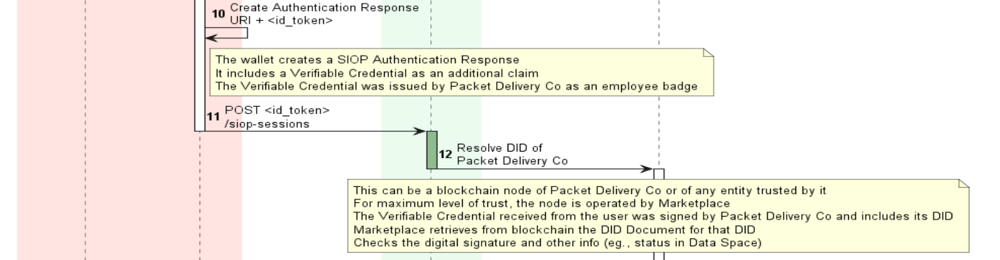
10.如果身份验证请求被验证为合法，钱包将生成一个身份验证响应，并在步骤5中Marketplace指定的redirect_uri中发布。该响应中会包含一个可验证凭证（VC），用来表明员工的身份和权限。

关键点：这个可验证凭证由包裹递送公司签发，证明该员工确实是公司的一员，并且拥有相应的访问权限。

11.钱包将身份验证响应发送到市场的SIOP会话接口。市场会根据接收到的响应来决定是否授予员工访问权限。
    
SIOP使用“application/x-www-form-urlencoded”编码的HTTP POST请求将身份验证响应 发送到 redirect_uri身份验证请求参数 中传递的端点。响应包含一个ID token和一个VP（可验证表示）token，如OpenID中为可验证表示定义的那样。
```JSON
POST /siop_sessions HTTP/1.1
Host: marketplace.fiware.io
Content-Type: application/x-www-form-urlencoded
id_token=eyJ0 ... NiJ9.eyJ1c ... I6IjIifX0.DeWt4Qu ... ZXso
&vp_token=...
&state=af0ifjsldkj
```
解码后的id_token：
```JSON
{
 "iss": "https://self-issued.me/v2",
 "aud": "did:elsi:EU.EORI.NLMARKETPLA",
 "iat": 1615910538,
 "exp": 1615911138,
 "sub": "did:peer:99ab5bca41bb45b78d242a46f0157b7d",
 "auth_time": 1615910535,
 "nonce": "n-0S6_WzA2Mj"
}
```
其中，"sub": "did:peer:99ab5bca41bb45b78d242a46f0157b7d"是用户本身的DID，处于隐私考虑，并没有注册在区块链或者任意一个集中存储库中。它必须与可验证凭证中包含的DID相同，可验证凭证是在员工入职时由包交付公司颁发的，并在身份验证响应中传播。
vp_token包括可验证的表示，它可以有两种格式：jwt_vp （JWT编码）或ldp_vp （JSON-LD编码）。下面的例子是使用JWT编码：
```JWT
{
 "format": "jwt_vp",
 "presentation":
 "eyJhbGciOiJSUzI1NiIsInR5cCI6IkpXVCIsImtpZCI6ImRpZDpleGFtcGxlOmFiZmUxM2Y3MTIxMjA0
 MzFjMjc2ZTEyZWNhYiNrZXlzLTEifQ.eyJzdWIiOiJkaWQ6ZXhhbXBsZTplYmZlYjFmNzEyZWJjNmYxY
 zI3NmUxMmVjMjEiLCJqdGkiOiJodHRwOi8vZXhhbXBsZS5lZHUvY3JlZGVudGlhbHMvMzczMiIsImlzc
 yI6Imh0dHBzOi8vZXhhbXBsZS5jb20va2V5cy9mb28uandrIiwibmJmIjoxNTQxNDkzNzI0LCJpYXQiO
 jE1NDE0OTM3MjQsImV4cCI6MTU3MzAyOTcyMywibm9uY2UiOiI2NjAhNjM0NUZTZXIiLCJ2YyI6eyJAY
 29udGV4dCI6WyJodHRwczovL3d3dy53My5vcmcvMjAxOC9jcmVkZW50aWFscy92MSIsImh0dHBzOi8vd
 3d3LnczLm9yZy8yMDE4L2NyZWRlbnRpYWxzL2V4YW1wbGVzL3YxIl0sInR5cGUiOlsiVmVyaWZpYWJsZ
 UNyZWRlbnRpYWwiLCJVbml2ZXJzaXR5RGVncmVlQ3JlZGVudGlhbCJdLCJjcmVkZW50aWFsU3ViamVjd
 CI6eyJkZWdyZWUiOnsidHlwZSI6IkJhY2hlbG9yRGVncmVlIiwibmFtZSI6IjxzcGFuIGxhbmc9J2ZyL
 UNBJz5CYWNjYWxhdXLDqWF0IGVuIG11c2lxdWVzIG51bcOpcmlxdWVzPC9zcGFuPiJ9fX19.KLJo5GAy
 BND3LDTn9H7FQokEsUEi8jKwXhGvoN3JtRa51xrNDgXDb0cq1UTYB-rK4Ft9YVmR1NI_ZOF8oGc_7wAp
 8PHbF2HaWodQIoOBxxT-4WNqAxft7ET6lkH-4S6Ux3rSGAmczMohEEf8eCeN-jC8WekdPl6zKZQj0YPB
 1rx6X0-xlFBs7cl6Wt8rfBP_tZ9YgVWrQmUWypSioc0MUyiphmyEbLZagTyPlUyflGlEdqrZAv6eSe6R
 txJy6M1-lD7a5HTzanYTWBPAUHDZGyGKXdJw-W_x0IWChBzI8t3kpG253fg6V3tPgHeKXE94fz_QpYfg
 --7kLsyBAfQGbg"
}
```
解码后是：
```JSON
{
    "@context": ["https://www.w3.org/2018/credentials/v1"],
    "type": ["VerifiablePresentation"],
    "verifiableCredential": [
    {
        "@context": [
        "https://www.w3.org/2018/credentials/v1",
        "https://marketplace.fiware.io/2022/credentials/employee/v1"
    ],
    "id": "https://pdc.fiware.io/credentials/6e14b8b8-87fa0014fe2a",
    "type": ["VerifiableCredential", "EmployeeCredential"],
    "issuer": {
    "id": "did:elsi:EU.EORI.NLPACKETDEL"
    },
    "issuanceDate": "2022-03-22T14:00:00Z",
    "validFrom": "2022-03-22T14:00:00Z",
    "expirationDate": "2023-03-22T14:00:00Z",
    "credentialSubject": {
    "id": "did:peer:99ab5bca41bb45b78d242a46f0157b7d",
    "verificationMethod": [
        {
        "id": "did:peer:99ab5bca41bb45b78d242a46f0157b7d#key1",
        "type": "JwsVerificationKey2020",
        "controller": "did:peer:99ab5bca41bb45b78d242a46f0157b7d",
        "publicKeyJwk": {
        "kid": "key1",
        "kty": "EC",
        "crv": "P-256",
        "x": "lJtvoA5_XptBvcfcrvtGCvXd9bLymmfBSSdNJf5mogo",
        "y": "fSc4gZX2R3QKKfHvS3m2vGSVSN8Xc04qsquyfEM55Z0"
        }
    }
 ],
    "roles": [
    {
    "target": "did:elsi:EU.EORI.NLMARKETPLA",
    "names": ["seller", "buyer"]
    }
 ],
    "name": "Jane Doe",
    "given_name": "Jane",
    "family_name": "Doe",
    "preferred_username": "j.doe",
    "email": "janedoe@packetdelivery.com"
     }
     }
 ]
}

```
12.市场通过通用解析器（Universal Resolver）解析包裹递送公司的DID文档，验证该公司的身份和公钥信息。这一步骤确保市场与一个合法的公司实体进行交互。该DID位于可验证演示中收到的可验证凭据内。这个DID可以在上面的“verifiableCredential”结构的“issuer”字段中找到。解析是通过向通用解析器发送GET请求来执行的：/api/did/v1/identifiers/did:elsi:EU.EORI。NLPACKETDEL市场可以使用由不同实体操作的通用解析器，但与使用直接连接到区块链网络的自己的服务器相比，这会降低信任水平。

#### 4.1.6 验证身份响应

13.市场获取包裹递送公司的DID文档，其中包含了公司的公钥和其他必要信息，用于后续的验证过程。

公司公钥与公司用于对员工刚刚展示的可验证凭证进行数字签名的私钥有关，作为身份验证流程的一部分。使用公钥和DID文档中的DID，它可以验证可验证凭证的签名，以及包交付公司是生态系统中的可信实体，并且它是活跃的。

14.市场使用包裹递送公司的公钥来验证身份响应的数字签名，确保身份响应确实是由合法的公司生成的。

以上内容仅用于验证可验证证书。此外，Marketplace还可以验证包含可验证凭据的可验证演示文稿是由员工发送的，而不是由恶意代理发送的。为此，它在“credentialSubject”结构的“verificationMethod”中使用员工的公钥。在Packet Delivery Co与其员工一起执行的入职过程中，该公钥以加密方式绑定到员工DID。

#### 4.1.7 创建、获取访问token
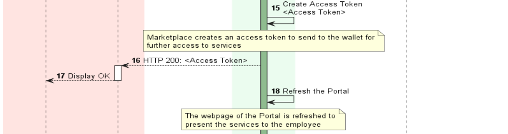
15.完成所有验证后，Marketplace为员工创建一个访问令牌，以便她将来可以使用它访问Marketplace服务器中的服务。

16.市场确认身份验证成功，向钱包返回HTTP 200状态码，并包含生成的访问令牌。

17.员工的钱包显示确认信息，表明身份验证和令牌获取过程顺利完成。

18.门户页面刷新后，员工可以看到新的服务选项，基于其身份和权限访问相关内容。
#### 4.1.8 请求订单创建服务
此时，Packet Delivery Co员工已登录到Marketplace应用程序。用户现在可以创建目录、产品和产品。

这时候，市场了解到的信息：
- 该Packet Delivery Co属于数据空间，并且可以颁发EmployeeCredential类型的凭据，因为它包含在可信发行者列表中并且是活动的，因为该信息在步骤13中检索的DID文档中。
- 那个Packet Delivery Co说用户是它的雇员之一。此信息位于可验证凭据内，该凭据由Packet Delivery Co进行数字签名。

从这一点开始，Marketplace可以向用户显示可用的服务，并在用户有权这样做的情况下执行这些服务。Marketplace可以使用凭据中的所有声明来执行RBAC/ABAC访问控制和策略实施。
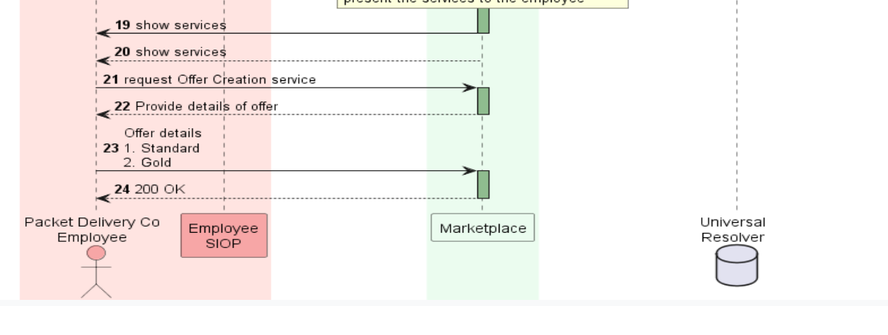
19.展示可提供的服务。

21.请求创建服务。

22.市场提供offer细节。

23.Offer可提供为Standard, Gold。用户进行选择。

24.创建成功，市场向钱包发送200 OK 信息。

### 4.2 获得权力/激活
流程展示了Happy Pets员工如何通过使用去中心化标识符（DID）和可验证凭证（VC），在Marketplace上获得特定服务的访问权限。整个流程旨在确保员工身份的安全验证，并提供透明的访问控制。

本流程与[4.1](#41-订单创建)的验证流程完全相同。不同之处是，Happy Pets或No cheap员工在Marketplace上的初始身份验证是使用由这些公司颁发给其员工的可验证凭证进行的，仅需将涉及的名称修改即可。在此不过多赘述。

### 4.3 访问数据服务
以下详细描述了Happy Pets客户在使用可验证凭据时更改PTA属性的过程。

参与方：Happy Pets(Authorisation Registry, Identity Provider), User(Customer SLOP), Packet Delivery(Portal, Proxy, Authorisation Registry, Blockchain Node)
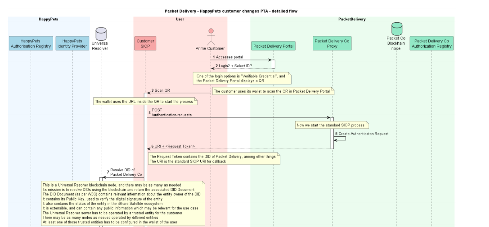
1.Happy Pets的客户可以访问快递公司门户网站或在智能手机上启动快递公司应用程序登录。

2.Happy Pets客户被转发到一个页面，用于选择所需的身份提供者进行登录。其中一个登录选项是“可验证凭据”或类似的东西。

3.Happy Pets客户选择“可验证凭据”登录方式，这将导致Packet Delivery Co.门户生成一个QR，其中包含包交付公司IDP的/身份验证请求端点的URL，发送给顾客的钱包。

4.客户用她的手机扫描QR，手机发送/authentication-requests请求端点。

5.Packet Delivery门户在收到钱包发送的认证请求后，开启一个标准的SIOP流程，生成一个请求令牌（Request Token），并将其返回给客户的钱包。这个令牌不仅包含了Packet Delivery的DID（去中心化标识符），还包括了一些其他关键信息。这个令牌的生成相当于给客户的钱包发放了一张临时通行证，钱包会使用它来继续后续的验证操作。请求令牌确保了接下来的验证步骤具有唯一性和安全性。

6.身份验证请求作为SIOP返回给客户钱包。SIOP流使用一个新的响应模式post，该post用于请求SIOP将身份验证过程的结果传递到某个端点。参数**response_mode**用于携带该值。SIOP交付身份验证结果的端点在标准参数**redirect_uri**中定义。

返回 URI+Request Token，Request Token包含一个Packet Delivery的DID。

7.在此步骤中，客户的钱包使用Universal Resolver来解析Packet Delivery公司的DID。解析在身份验证请求的client_id参数中接收到的Packet Delivery公司的DID，验证数据包交付公司是属于生态系统的受信任实体。
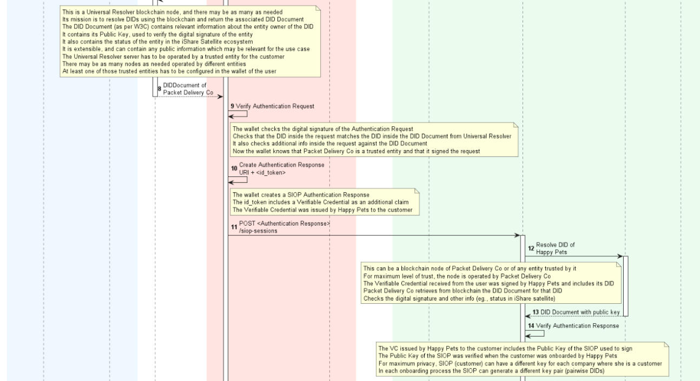
8.Universal Resolver返回Packet Delivery公司的DID文档，该文档不仅包含了Packet Delivery的公钥，还包含了它在信任网络中的状态信息。这些信息帮助客户的钱包确认Packet Delivery公司是一个可信的实体，并且它在整个数据生态系统中扮演着可靠的角色。通过检查DID文档中的信息，钱包可以进一步确认即将发送和接收的数据不会被篡改或伪造。

9.客户的钱包使用从DID文档中获得的信息来验证Packet Delivery门户的认证请求。首先，钱包会检查认证请求的数字签名，以确认请求确实是由Packet Delivery公司签署的。这一步就像是检查护照上的签名是否与持有者的签名一致，以确保请求的真实性和完整性。接下来，钱包会核对认证请求中的DID与之前解析的DID文档中的信息是否匹配，从而确保请求没有被篡改，并且确实来自于真正的Packet Delivery公司。

10.客户钱包创建一个身份验证响应(URI+id_token)，将在第5步中由Packet Delivery公司指定的redirect_uri中发布。id_token需要包含客户DID，以及VC作为另外声明，顾客的VC由Happy Pets授予。

11.客户的钱包将生成的认证响应提交给Packet Delivery门户的特定API端点（如`/siop-sessions`），这相当于在安检口提交了你的通行证。Packet Delivery门户会检查这一响应，验证客户的身份以及与之关联的可验证凭证，以确保客户有权访问相应的服务。这一步验证了客户的数字身份和凭证的完整性，确保信息在传输过程中没有被篡改或伪造。

12.Packet Delivery门户通过Universal Resolver解析Happy Pets的DID。该DID位于可验证演示中收到的可验证凭据内。这个DID可以在上面的“verifiableCredential”结构的“issuer”字段中找到。

13.Packet Delivery接收Happy Pets的DID文档，其中包含有关公司的可信信息，包括与Happy Pets用于对客户刚刚在可验证表示中发送的可验证凭证进行数字签名的私钥相关联的公钥，作为身份验证流的一部分。使用公钥和DID文档中的DID，它可以验证可验证凭证的签名，并且Happy Pets是生态系统中的可信实体。

14.以上内容仅用于验证可验证证书。此外，包交付公司还可以验证包含可验证凭据的可验证表示是由客户发送的，而不是由恶意代理发送的。为此，它在“credentialSubject”结构的“verificationMethod”中使用客户的公钥。在Happy Pets与客户一起执行的入职过程中，该公钥以加密方式绑定到客户DID

15.完成所有验证后，Packet Delivery company为客户创建一个访问令牌，以便她将来可以使用它访问Packet Delivery company中的服务。

16.钱包（SIOP）收到对POST请求的成功回复。

17.Packet Delivery公司代理通知Packet Delivery门户客户已成功通过身份验证，门户可以显示该客户可用的服务。用户的浏览器接收到由分组交付（Packet Delivery）创建的访问令牌（Access Token），使其无需经过前面的认证过程就可以请求服务。访问令牌是一个标准的OAuth访问令牌，它包含了数据包交付访问其服务所需的信息。

此时，Happy Pets客户已登录到包裹递送公司门户/应用程序，并看到可能提供的服务，包括更改其递送订单的PTA的选项。
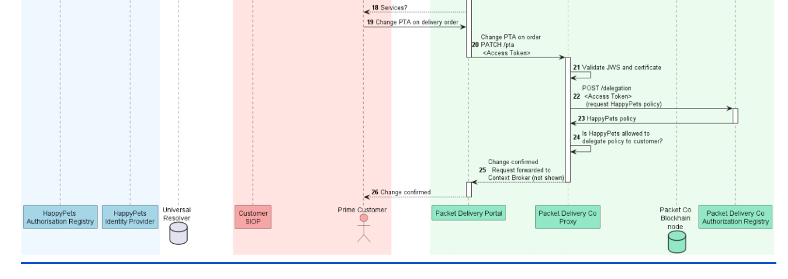
18.Happy Pets客户将看到Packet Delivery提供的可能服务，包括更改其交付订单的PTA的选项。

19.Happy Pets客户搜索他的包裹递送订单，并显示其详细信息。他现在要求在包交付公司门户/应用程序上更改此订单的PTA。

20.Packet Delivery Portal/APP向Packet Delivery Proxy发送请求，以更改交付订单的PTA。请求包含步骤15中生成的Access Token，以及要从中检索策略的授权注册中心的信息。

```JSON
> Authorization: Bearer IIeD...NIQ // Bearer JWT
> Content-Type: application/json
PATCH https://umbrella.fiware.io/ngsi-ld/v1/entities/urn:ngsild:DELIVERYORDER:001/attrs/pta
> Payload
{
 "value": "<new PTA>",
 "type": "Property"
}
Decoded Bearer JWT payload:
{
    "iss": "EU.EORI.NLHAPPYPETS", // Issuer: Happy Pets
    "sub": "419404e1-07ce-4d80-9e8a-eca94vde0003de", // Customer pseudonym
    "jti": "d8a7fd7465754a4a9117ee28f5b7fb60",
    "iat": 1591966224,
    "exp": 1591966254,
    "aud": "EU.EORI.NLHAPPYPETS",
    "authorisationRegistry": { // AR to retrieve policies from
        "url": "https://ar.packetdelivery.com",
        "identifier": "EU.EORI.NLHAPPYPETS",
        "delegation_endpoint": "https://ar.packetdelivery.com/delegation",
    }
}
```
21.Packet Delivery Co. Proxy收到了步骤19更改交付订单的PTA的请求。从客户接收到的access token确保为她分配了带有更新此特定交付订单的PTA属性的策略的委托证据（在用户级别称为发布）。此外，由于在此场景中所需的客户策略是由第三方（Happy Pets）发布的，代理必须检查Happy Pets本身是否允许委托此策略。一般来说，规则是代理需要通过**发行者链**检查有效策略的存在，直到它自己（在本例中是包交付公司）成为发行者。在此场景中，代理将在两个不同的级别检查策略：组织层面（从Packet Delivery company到Happy Pets）和用户层面（从Happy Pets到客户）。可验证凭据负责用户级策略。

22.为了检查Happy Pets是否允许将策略委托给其客户，procy将在Packet Delivery Authorization Registry检查该策略是否存在。Proxy将请求发送到Packet Delivery Authorization Registry的端点。

23.Proxy接收Packet Delivery发给Happy Pets的委托证据策略。

24.收到来自Packet Delivery company Authorization Registry的委托信息后，Proxy（或者更准确地说，PDP）现在可以评估所包含的组织策略是否允许更新PTA属性，从而评估是否允许Happy Pets将访问委托给其客户。如果Proxy接收到有效的策略，则将在组织级别授予访问权限。

如果无法找到请求的委托证据，或者返回的策略包含Deny规则，则PTA的更改将被Packet Delivery company代理拒绝，并将错误返回给Packet Delivery company门户/应用程序，同时显示给Happy Pets客户。以下步骤可以省略。

25.如前面步骤中所述，PDP评估了在组织级别和用户级别上授予特定交付订单的PTA的更改。因此，更改PTA的请求由Proxy转发给上下文代理，后者保存包交付订单的信息。包裹递送顺序的PTA被更改，上下文代理返回一个HTTP代码204的成功响应。上下文代理响应返回到Portal，以响应步骤26的请求。

26.将成功的PTA变更呈现给Happy Pets客户。

### 4.4 无权限
本节描述上述步骤在No cheaper客户场景中的变化。

基本上步骤顺序与Happy Pets相同。与Happy Pets相反，在[权利获取/激活](#42-获得权力激活)中描述的权利获取过程中，No cheaper只是获取标准服务，因此其客户只能读取交付订单的属性。这意味着在包交付授权注册中心，只创建了一个策略，允许No cheaper只将GET访问权委托给交付订单。

此场景可分为两种情况，以演示基于组织级别和用户级别的不同策略拒绝访问。

1. 在No cheaper授权注册中心，向No cheaper客户颁发可验证凭据，仅允许向包交付服务（代表p.f info . standard角色）发出GET请求。当执行更改交付订单的PTA值的步骤时（如前一节所述），流程将在步骤19处停止，此时将拒绝访问，因为没有在用户级别为No cheap客户分配必要的策略。

2. 在No cheaper授权注册中心，向No cheaper客户颁发可验证凭据，允许向包交付服务（代表p.f info . gold角色）发出GET和PATCH请求。当执行更改交付订单的PTA值的步骤时，如前一节所述，流程将在步骤23处停止，此时访问将被拒绝，因为在包交付公司授权注册中心没有为No cheap分配必要的策略来将高级访问委托给其客户。

因此，将在组织级别拒绝访问。这是为了表明，即使No cheap组织在其自己的Authorization Registry中向其客户颁发对高级服务的访问权，访问仍然会被拒绝。

一般来说，对于这两种情况，改变PTA的要求都应予以拒绝。但是，可以显示No cheaper客户能够查看其交付订单的属性。

### 4.5 为Connectors / application context发布token


